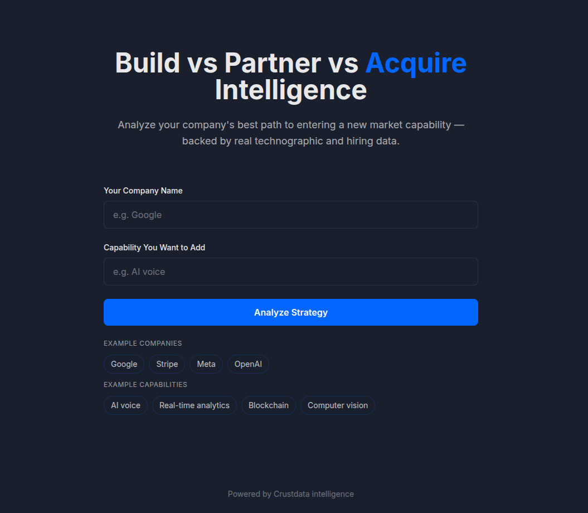
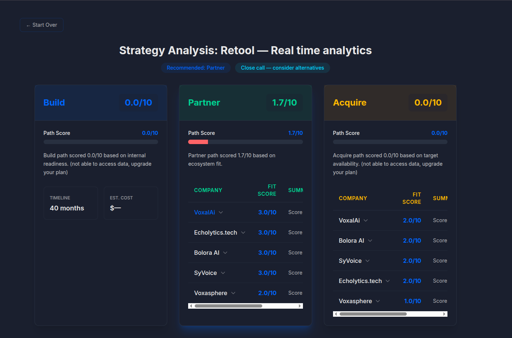

# [Decision Engine — Build vs Partner vs Acquire](https://decision-engine-frontend-209363122989.us-central1.run.app/)

An AI decision engine that takes a strategic goal like "We want to enter AI voice" and recommends whether your company should **Build**, **Partner**, or **Acquire** to gain that capability — backed by real [Crustdata](https://crustdata.com) company, people, jobs, and funding data.




Scoring is deterministic and code-driven via `rubric.yaml`. The LLM is used only for translation and narrative, never for computing scores.

## How It Works

1. **Classify** — The LLM layer translates the free-text goal into a capability taxonomy (taxonomy tags, search keywords, signal descriptors). It does not score anything.
2. **Fetch** — The caching client retrieves [Crustdata](https://crustdata.com) data for your company (enrichment, jobs, headcount) and searches for relevant candidates across all three paths. Every response is cached before touching scoring logic.
3. **Score** — The scoring engine evaluates each path (Build, Partner, Acquire) against criteria defined in `rubric.yaml`. Missing data for a criterion excludes it and renormalizes remaining weights — never defaulting to 0 or 5.
4. **Recommend** — The highest-scoring path wins. If the top two scores are within 1.0, it's flagged as a "close call" and both paths are presented with trade-offs.

Every score carries a provenance record: `{criterion_id, raw_value, source_field, api_call_id, timestamp}`.

## Architecture

```
                 ┌──────────────────────────────────────────────────┐
                 │                    CLI / API                       │
                 │  cli/main.py  │  api/main.py (FastAPI)            │
                 └───────┬────────────────────────────────────────┘
                         │  goal + my_company
                         │
                 ┌───────▼────────────────────────────────────────┐
                 │                    LLM Layer                    │
                 │  llm/classify.py  │  llm/synthesize.py          │
                 │  Prompts in llm/prompts/ (versioned)            │
                 │  → taxonomy tags, search keywords               │
                 └───────┬────────────────────────────────────────┘
                         │  taxonomy tags + company name
                         │
                 ┌───────▼────────────────────────────────────────┐
                 │              Data Layer                        │
                 │              data/caching_client.py              │
                 │  ┌─────────┐    ┌────────────────────────┐      │
                 │  │ Cache   │◄──▶│ CrustdataClient         │      │
                 │  │ SQLite  │    │ (raw HTTP, retries)    │      │
                 │  └─────────┘    └────────────────────────┘      │
                 │  Returns: (pydantic model, provenance record)   │
                 └───────┬────────────────────────────────────────┘
                         │  enriched data + api_call_ids
                         │
                 ┌───────▼────────────────────────────────────────┐
                 │            Scoring Engine                       │
                 │              scoring/engine.py                  │
                 │  ┌──────────────────────────────────────────┐  │
                 │  │  Reads rubric.yaml (no hardcoded weights) │  │
                 │  │  For each criterion:                      │  │
                 │  │    • score_build_path()                   │  │
                 │  │    • score_partner_path()                 │  │
                 │  │    • score_acquire_path()                 │  │
                 │  │    → CriterionScore with evidence         │  │
                 │  └──────────────────────────────────────────┘  │
                 │  → PathScore → AnalysisOutput (recommendation)│
                 └───────┬────────────────────────────────────────┘
                         │  final scores + evidence trail
                         │
                 ┌───────▼──────────────┐
                 │      Output          │
                 │  Scores, candidates,  │
                 │  recommendation,     │
                 │  provenance trail    │
                 └──────────────────────┘
```

### Layer separation

- **`/data`** — [Crustdata](https://crustdata.com) client + SQLite response cache + provenance wrapper. All API calls go through `CachingClient`; direct `CrustdataClient` use elsewhere is a layering violation.
- **`/scoring`** — Deterministic rubric engine. Reads `rubric.yaml` and never calls the LLM. Every score carries a provenance record.
- **`/llm`** — Versioned prompt templates + synthesis logic. Translates goals to taxonomies and writes narratives from already-scored evidence.
- **`/api`** — FastAPI service exposing the analysis as an HTTP endpoint.
- **`/cli`** — `argparse`-based entry point for demos.

## The Role of `rubric.yaml`

`rubric.yaml` is the **single source of truth** for how each path is scored. It defines:

- **Path weights** — Each path declares a `weight_in_final_decision` (Build 0.34, Partner 0.33, Acquire 0.33) defining its share in the final recommendation. These are stored on each `PathScore` and intended for cross-path weighting; the current MVP selects the recommendation by comparing raw path scores directly.
- **Criteria** — Each criterion has an `id`, plain-English `description`, `source` (which [Crustdata](https://crustdata.com) data endpoint), `weight`, and `scale`.
- **Weight renormalization** — If a criterion's source data is unavailable, it is excluded and its weight redistributed proportionally to the remaining criteria. It is never defaulted to 0 or 5.
- **Close-call detection** — If the top two path scores are within 1.0, the recommendation flags both paths with trade-offs instead of forcing a single answer.
- **Output format** — Defines the structure of `AnalysisOutput` including `final_scores`, `recommendation`, `evidence_trail` (with provenance records), `candidate_companies`, and `assumptions_and_gaps`.

Because the rubric is YAML, reviewers can read the full decision logic without opening Python code. Weights and criteria can be tuned without touching scoring code.

## Setup

### Prerequisites

- Python 3.11+
- [Crustdata](https://crustdata.com) API key
- Groq API key (for LLM classification and narrative synthesis)

### Local Installation

```bash
python -m venv .venv
source .venv/bin/activate
pip install -r requirements.txt
```

### Configuration

Copy the example env file and fill in your keys:

```bash
cp .env.example .env
# Edit .env with your API keys
```

| Variable | Description |
|---|---|
| `CRUSTDATA_API_KEY` | [Crustdata](https://crustdata.com) API key |
| `GROQ_API_KEY` | Groq API key for LLM calls |

Never commit `.env`. The SQLite cache database is stored at `.cache/crustdata_cache.db` by default (gitignored).

## Usage

### CLI

```bash
python -m cli.main --my-company "Stripe" --capability "AI voice"
```

The CLI fetches your company's enrichment, jobs, and headcount, searches for candidates across all three paths, scores each path, and prints the recommendation with candidate lists and reasoning.

### API

Run the API server:

```bash
uvicorn api.main:app --reload
```

Health check:

```bash
curl http://localhost:8080/health
```

Analyze a strategy:

```bash
curl -X POST http://localhost:8080/analyze-strategy \
  -H "Content-Type: application/json" \
  -d '{"my_company": "Stripe", "capability": "AI voice"}'
```

Returns per-path analysis with scores, reasoning, candidate lists, and estimated timeline/cost for building.

## Deployment

Build and run with Docker:

```bash
docker build -t decision-engine .
docker run -p 8080:8080 --env-file .env decision-engine
```

The `Dockerfile` installs the package and runs `api.main` on port 8080, which is the port used by Cloud Run and other managed platforms.

## Testing

```bash
# Run tests (no live API calls — all Crustdata data is mocked)
pytest -q

# Lint
ruff check .

# Type check
mypy .
```

- **Test coverage: 89%**
- Test fixtures with mocked [Crustdata](https://crustdata.com) responses live in `tests/fixtures/`.

## Notes

This is a proof-of-concept project. It uses the free [Crustdata](https://crustdata.com) API tier, which has limited data coverage. Results may be incomplete or unclear, especially for company enrichment technographics and certain endpoints.
